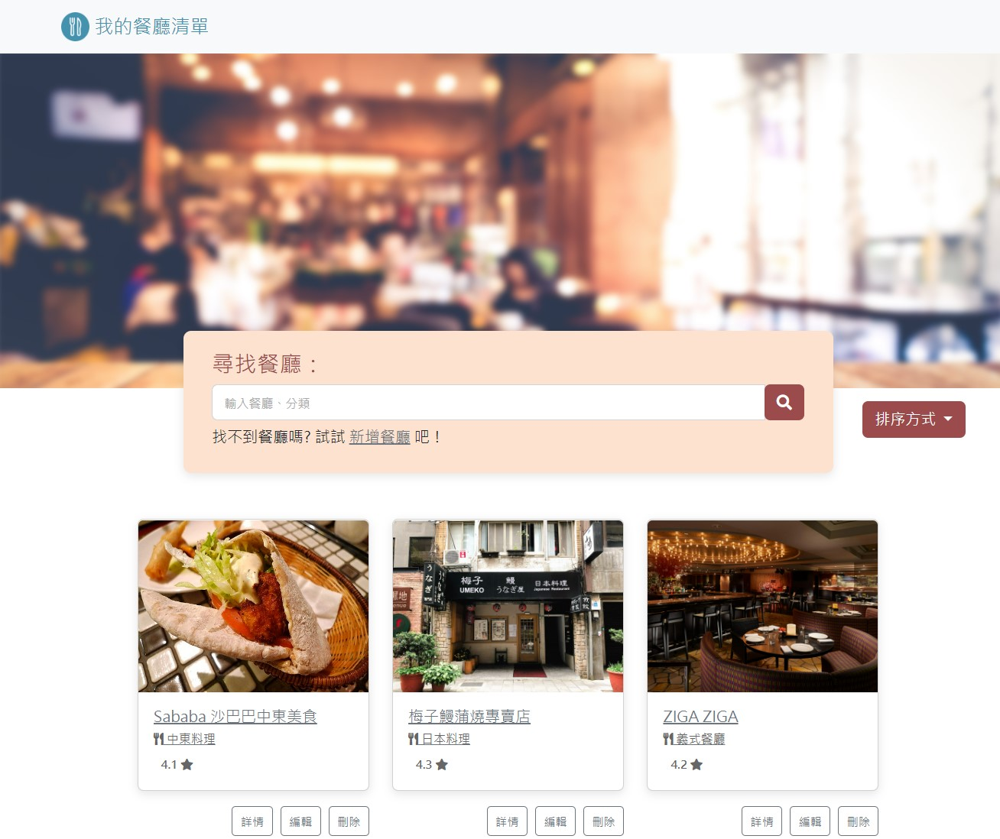

# Restaurant List

A list designed to create, edit, delete, search restaurants and show each restaurant in details.
**(Update: Login and registration functions are completed, so that everyone could have their own list.)**



## Installing

1. 開啟終端機(Terminal)，clone 此專案至本機電腦
```
git clone https://github.com/peggy8865/restaurant-list.git
```

2. 初始化
```
cd restaurant-list  // 進入存放位置的資料夾
npm install  // 安裝套件
```

3. 設定連線至 MongoDB
```
touch .env // 新增檔案".env"
code .env // 開啟".env" 並設定連線字串如下：
```
```
MONGODB_URI=mongodb+srv://<你的 MongoDB 帳號>:<你的 MongoDB 密碼>@cluster0.xxxx.xxxx.net/<你的 MongoDB 資料庫名稱>?retryWrites=true&w=majority
```

4. 設定其他環境變數 `(同樣在".env" 做設定)`
```
FACEBOOK_ID=<註冊應用程式的編號>
FACEBOOK_SECRET=<註冊應用程式的密鑰>
FACEBOOK_CALLBACK=http://localhost:3000/auth/facebook/callback
SESSION_SECRET=<自行填入>
PORT=3000
```

5. 新增種子資料
```
npm run seed
```

6. 啟動程式
```
npm run dev
```

7. 終端顯示以下畫面即啟動完成，請至 http://localhost:3000 開始使用程式
```
Express is listening on http://localhost:3000
mongodb connected!
```

8. 可用下列種子資料登入
```
信箱: user1@example.com
密碼: 12345678
```
```
信箱: user2@example.com
密碼: 12345678
```

9. 結束程式
```
ctrl + c
```

## Built With

* [Node.js @18.12.0](https://nodejs.org/en/) - The web framework used
* [express @4.16.4](https://www.npmjs.com/package/express) - Dependency Management
* [express-handlebars @3.0.0](https://www.npmjs.com/package/express-handlebars) - Dependency Management
* [express-session @1.17.1](https://www.npmjs.com/package/express-session) - Dependency Management
* [method-override @3.0.0](https://www.npmjs.com/package/method-override) - Dependency Management
* [MongoDB Atlas](https://www.mongodb.com/atlas/database) - Database service
* [mongoose @5.13.15](https://www.npmjs.com/package/mongoose) - Dependency Management
* [dotenv @16.0.3](https://www.npmjs.com/package/dotenv) - Develop dependency Management
* [passport @0.4.1](https://www.npmjs.com/package/passport) - Dependency Management
* [passport-local @1.0.0](https://www.npmjs.com/package/passport-local) - Dependency Management
* [passport-facebook @3.0.0](https://www.npmjs.com/package/passport-facebook) - Dependency Management
* [connect-flash @0.1.1](https://www.npmjs.com/package/connect-flash) - Dependency Management
* [bcryptjs @2.4.3](https://www.npmjs.com/package/bcryptjs) - Dependency Management

## Acknowledgement

* [README-Template.md](https://gist.github.com/PurpleBooth/109311bb0361f32d87a2) - PurpleBooth
* Templates partially provided by AC